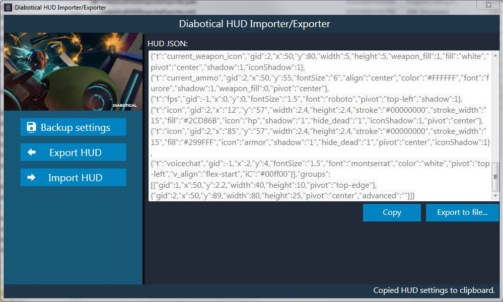

## Imports/Exports Diabotical HUDs

Start by selecting an action on the left:

* Backup Settings: Backs up *all* Diabotical settings to a file/path of your choosing. 
A good place to start before importing a new HUD in case you break everything.

* Export HUD: Exports HUD settings to either to a copy/paste window or to a file
which you can share with your friends, assuming you have friends.

* Import HUD: Imports HUD from either a file that your 'friends' sent or 
from the paste-able input box. 

